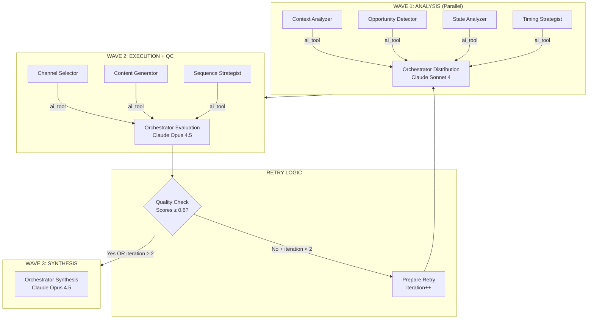
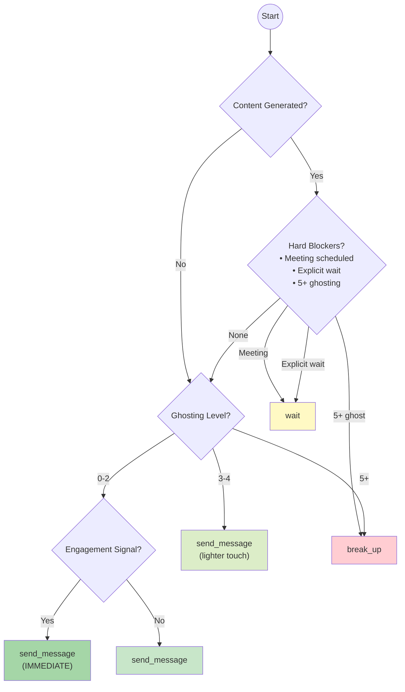

# Sales-IA

AI-powered sales orchestration system using multi-agent architecture on n8n workflow platform.

## Overview

Sales-IA analyzes CRM contacts and generates personalized outreach recommendations using Claude AI through a 3-wave multi-agent pipeline.

## Architecture

### High-Level Flow

```
INPUT (Webhook POST)
    → Validation + Constants
    → WAVE 1 (4 Analysis Agents)
    → Historical Data Fetch
    → WAVE 2 (3 Action Agents + Quality Check)
    → Retry Loop (max 2 iterations)
    → WAVE 3 (Synthesis)
    → Save to Supabase
    → Notify via Slack/Zapier
```

### 3-Wave Pipeline



### Decision Flow



## Tech Stack

| Component | Technology |
|-----------|------------|
| Platform | n8n (workflow automation) |
| AI Models | Claude Sonnet 4, Claude Opus 4.5 |
| Database | Supabase (PostgreSQL) |
| Notifications | Slack via Zapier |
| CRM | HubSpot-compatible structure |

## Project Structure

```
sales-ia/
├── n8n-workflow.json              # Main workflow (import into n8n)
├── webhook-input-contact-example.json  # Test payload template
└── prompts/                       # AI agent system prompts
    ├── Orchestrator Distribution/  # Wave 1 consolidation
    ├── Orchestrator Evaluation/    # Wave 2 quality control
    ├── Orchestrator Synthesis/     # Final decision maker
    └── Tools Agents/               # 7 specialized agents
```

## Agent Responsibilities

| Agent | Wave | Purpose |
|-------|------|---------|
| Context Analyzer | 1 | Relationship depth & trajectory |
| Opportunity Detector | 1 | Sales hooks & opportunities |
| State Analyzer | 1 | Conversation state & urgency |
| Timing Strategist | 1 | Optimal contact timing |
| Channel Selector | 2 | Best communication channel |
| Content Generator | 2 | Message creation |
| Sequence Strategist | 2 | Multi-touch planning |

## Quick Start

1. Import `n8n-workflow.json` into n8n
2. Configure Claude/Anthropic API credentials
3. Configure Supabase connection
4. Trigger webhook:

```bash
curl -X POST https://your-n8n/webhook/multi-agent-orchestrator \
  -H "Content-Type: application/json" \
  -d @webhook-input-contact-example.json
```

## Output Actions

| Action | When Used |
|--------|-----------|
| `send_message` | Content exists, no blockers (DEFAULT) |
| `wait` | Meeting scheduled or explicit request |
| `break_up` | 5+ outbounds without response |
| `no_action` | Contact opted out or invalid |

## Documentation

- **[CLAUDE.md](CLAUDE.md)** - Complete technical documentation and agent instructions
- **[WORKFLOW-DIAGRAM.md](WORKFLOW-DIAGRAM.md)** - Detailed workflow architecture with node references

## Execution Time

~7 minutes per contact (async processing with immediate webhook response)
