# Sales-IA

AI-powered sales orchestration system using multi-agent architecture on n8n workflow platform.

## Overview

Sales-IA analyzes CRM contacts and generates personalized outreach recommendations using Claude AI through a 3-wave multi-agent pipeline.

## Architecture

### High-Level Flow

```
INPUT (Webhook POST /parallel-kam-agent)
    → Get resources (Google Sheets)
    → Get practices (Google Sheets)
    → Merge GSheet Data
    → Generate UUID + Respond to Webhook
    → Save data call
    → WAVE 1 (4 Analysis Agents called in parallel)
    → Merge Wave1_results
    → Orchestrator Wave 1 Evaluation
    → Parse evaluation JSON
    → Retry Switch (continue or retry)
    → IF continue: Get historical recommendations + WAVE 2 (3 Action Agents)
    → IF retry: Loop back to Generate UUID (max 3 iterations)
    → Merge Wave2_results
    → WAVE 3 (Orchestrator Synthesis)
    → Parse JSON
    → Save to Supabase (2 tables) + Collect Workflow Run + Evaluate Decision
    → Notify via Slack/Zapier
```

### 3-Wave Pipeline


### Decision Flow

```mermaid
flowchart TB
    START((Start))

    CHECK_CONTENT{"Content Generated?"}
    CHECK_BLOCKERS{"Hard Blockers?<br/>• Meeting scheduled<br/>• Explicit wait<br/>• 5+ ghosting"}
    CHECK_GHOST{"Ghosting Level?"}
    CHECK_ENGAGE{"Engagement Signal?"}

    SEND["send_message"]
    SEND_LIGHT["send_message<br/>(lighter touch)"]
    SEND_NOW["send_message<br/>(IMMEDIATE)"]
    WAIT["wait"]
    BREAKUP["break_up"]

    START --> CHECK_CONTENT
    CHECK_CONTENT -->|"Yes"| CHECK_BLOCKERS
    CHECK_CONTENT -->|"No"| CHECK_GHOST

    CHECK_BLOCKERS -->|"Meeting"| WAIT
    CHECK_BLOCKERS -->|"Explicit wait"| WAIT
    CHECK_BLOCKERS -->|"5+ ghost"| BREAKUP
    CHECK_BLOCKERS -->|"None"| CHECK_GHOST

    CHECK_GHOST -->|"0-2"| CHECK_ENGAGE
    CHECK_GHOST -->|"3-4"| SEND_LIGHT
    CHECK_GHOST -->|"5+"| BREAKUP

    CHECK_ENGAGE -->|"Yes"| SEND_NOW
    CHECK_ENGAGE -->|"No"| SEND

    style SEND fill:#c8e6c9
    style SEND_LIGHT fill:#dcedc8
    style SEND_NOW fill:#a5d6a7
    style WAIT fill:#fff9c4
    style BREAKUP fill:#ffcdd2
```



## Tech Stack

| Component | Technology |
|-----------|------------|
| Platform | n8n (workflow automation) |
| AI Models | Claude Opus 4.5 |
| Database | Supabase (PostgreSQL) |
| External Data | Google Sheets (resources & best practices) |
| Notifications | Slack via Zapier |
| CRM | HubSpot-compatible structure |

## Project Structure

```
sales-ia/
├── n8n-workflow.json              # Main workflow (import into n8n)
├── webhook-input-contact-example.json  # Test payload template
└── prompts/                       # AI agent system prompts
    ├── Orchestrator Distribution/  # Wave 1 consolidation
    ├── Orchestrator Evaluation/    # Wave 2 quality control
    ├── Orchestrator Synthesis/     # Final decision maker
    └── Tools Agents/               # 7 specialized agents
```

## Agent Responsibilities

| Agent | Wave | Purpose |
|-------|------|---------|
| Context Analyzer | 1 | Relationship depth & trajectory |
| Opportunity Detector | 1 | Sales hooks & opportunities |
| State Analyzer | 1 | Conversation state & urgency |
| Timing Strategist | 1 | Optimal contact timing |
| Channel Selector | 2 | Best communication channel |
| Content Generator | 2 | Message creation |
| Sequence Strategist | 2 | Multi-touch planning |

## Quick Start

1. Import `n8n-workflow.json` into n8n
2. Configure Claude/Anthropic API credentials
3. Configure Supabase connection
4. Trigger webhook:

```bash
curl -X POST https://your-n8n/webhook/parallel-kam-agent \
  -H "Content-Type: application/json" \
  -d @webhook-input-contact-example.json
```

## Output Actions

| Action | When Used |
|--------|-----------|
| `send_message` | Content exists, no blockers (DEFAULT) |
| `wait` | Meeting scheduled or explicit request |
| `break_up` | 5+ outbounds without response |
| `no_action` | Contact opted out or invalid |

## V15.5 Features (Latest)

### Google Sheets Integration
Resources catalog and best practices are now fetched from Google Sheets:
- **Resources**: Matched to opportunities for relevant content suggestions
- **Best Practices**: Used by Content Generator for message quality

### Decision Evaluation
Post-synthesis, decisions are evaluated for quality by a separate Claude call:
- Logs evaluation results for continuous improvement
- Workflow run data saved to Supabase for analytics

### V15.3 Semantic Outbound Analysis
Distinguishes between conversation bursts and follow-up attempts:
- Messages on same day as inbound = conversation (not separate outreach)
- Messages on different days = distinct follow-up attempts
- Ghosting thresholds now use distinct follow-up count

### V15.1 Bug Fixes
- Consecutive outbound counting now uses semantic analysis
- Question count validation (max 1 question per message)
- Meeting responsibility attribution

### Multi-Deal Detection (V14)
Contacts may have multiple deals. System detects all deals and prioritizes:
- **OPEN deal** takes priority → Active prospect messaging
- **CLOSED_WON** → Customer success messaging
- **CLOSED_LOST** (all) → Nurture/re-engagement

### Multi-Owner Coordination
Tracks activities from all team members to prevent duplicate outreach:
- If another team member has activity < 14 days → Coordinate before sending
- If scheduled touchpoint exists → Wait

### Scheduled Touchpoint Detection
Scans emails/notes for scheduled meetings to avoid redundant outreach:
- Detects date mentions: "semaine du 13/1", "le 07/01"
- Detects confirmations: "OK pour", "c'est noté"

### Churn Signal Detection (V13)
Scans email bodies for contract termination signals:
- Overrides HubSpot deal status when churn detected
- Detects meeting cancellations post-churn
- Extracts future recontact timing ("automne 2026")

### Synthesis Safety Checks (V15.0+)
7 validation checks before final output:
1. Unclosed Loops (unfulfilled promises)
2. Multi-Owner Coordination
3. Temporal Reference Accuracy
4. Open Deal Template Consistency
5. Churn Signal Detection
6. Question Count Validation (V15.1)
7. Meeting Responsibility Attribution (V15.2)

## Documentation

- **[CLAUDE.md](CLAUDE.md)** - Complete technical documentation and agent instructions
- **[WORKFLOW-DIAGRAM.md](WORKFLOW-DIAGRAM.md)** - Detailed workflow architecture with node references

## Execution Time

~10 minutes per contact (async processing with immediate webhook response)
