# Sales-IA Workflow Architecture

## Quick Reference for AI Agents

This document is the **exact photograph** of the n8n workflow for AI agents to understand the system architecture without parsing the full JSON.

**Last verified**: 2025-12-18 against `n8n-workflow.json`
**Estimated execution time**: ~7 minutes per contact

---

## Executive Summary

```
INPUT (Webhook POST)
    → Validation + Constants
    → WAVE 1 (4 Analysis Agents)
    → Historical Data Fetch
    → WAVE 2 (3 Action Agents + Quality Check)
    → Retry Loop (max 2 iterations)
    → WAVE 3 (Synthesis)
    → Save to Supabase
    → Notify via Slack/Zapier
```

---

## Main Flow Diagram


---

## Complete Node List (26 nodes total)

| # | Node Name | Type | Key Parameters |
|---|-----------|------|----------------|
| 1 | Webhook | webhook | POST /multi-agent-orchestrator, responseMode: responseNode |
| 2 | Input Validator | code | Validates contact_info, activities, stats |
| 3 | Constants | set | session_id, iteration_count=1, MAX_RETRY=2 |
| 4 | Respond to Webhook | respondToWebhook | Returns session_id, "~7 min wait" |
| 5 | Merge | merge | Combines Input Validator + Constants |
| 6 | Orchestrator Distribution | agent | Sonnet 4, temp 0.2, retryOnFail |
| 7 | Context Analyzer | toolWorkflow | Sub-workflow AvvHbsi6znhLenHt |
| 8 | Opportunity Detector | toolWorkflow | Sub-workflow x8FhUOAPaob2UAsD |
| 9 | State Analyzer | toolWorkflow | Sub-workflow p5j7uHQGG4MXtzDQ |
| 10 | Timing Strategist | toolWorkflow | Sub-workflow SA9CbSZ6gG4VbLr3 |
| 11 | Sonnet 4 Model | lmChatAnthropic | claude-sonnet-4-20250514, temp 0.2 |
| 12 | AI_sales_agents Memory2 | memoryPostgresChat | Table: n8n_orchestrator_distribution |
| 13 | Get historial recomendations | supabase | getAll, limit 10, validated only |
| 14 | Merge2 | merge | Distribution + Historical |
| 15 | Orchestrator Evaluation | agent | Opus 4.5, temp 0.4, executeOnce |
| 16 | Channel Selector | toolWorkflow | Sub-workflow IranprNKAkWymI1n |
| 17 | Content Generator | toolWorkflow | Sub-workflow SD8ssifoO3WmgV6E |
| 18 | Sequence Strategist | toolWorkflow | Sub-workflow 9yaALVGtzyMSW3tm |
| 19 | Opus 4.5 Model2 | lmChatAnthropic | claude-opus-4-5-20251101, temp 0.4 |
| 20 | AI_sales_agents Memory1 | memoryPostgresChat | Table: n8n_orchestrator_evaluation |
| 21 | Parse Evaluation Decision | code | Extracts action, checks iteration |
| 22 | Retry? | switch | Output 0: retry, Output 1: continue |
| 23 | Prepare Retry Context | code | iteration++, retry_instructions |
| 24 | Orchestrator Synthesis | agent | Opus 4.5, temp 0.6, executeOnce |
| 25 | Opus Model | lmChatAnthropic | claude-opus-4-5-20251101, temp 0.6 |
| 26 | AI_sales_agents Memory | memoryPostgresChat | Table: n8n_orchestrator_synthesis |
| 27 | Parse JSON | code | Extracts final_decision, adds metadata |
| 28 | Save final decision reference | supabase | UPDATE n8n_orchestrator_synthesis |
| 29 | Save final decision into table | supabase | INSERT final_decision, retryOnFail |
| 30 | Send to Zapier for Slack | httpRequest | POST to Zapier webhook |

---

## Data Flow: What Each Node Receives

```mermaid
flowchart TB
    subgraph WEBHOOK_DATA["📥 Webhook Input Structure"]
        direction LR
        WD1["body.contact_info<br/>(name, job, company, linkedin_url, owner)"]
        WD2["body.activities[]<br/>(activity_type, direction, recorded_on, metadata)"]
        WD3["body.stats<br/>(total_activities, by_type)"]
    end

    subgraph IV_OUTPUT["Input Validator Output"]
        direction LR
        IVO1["contact_info (passthrough)"]
        IVO2["activities (passthrough)"]
        IVO3["stats (passthrough)"]
        IVO4["validation<br/>(is_valid, errors, warnings, available_channels)"]
        IVO5["conversation_analysis<br/>(lastInbound, lastOutbound, daysSinceLastContact)"]
    end

    subgraph CONST_OUTPUT["Constants Output"]
        direction LR
        CO1["SEMANTIC_CONSTANTS<br/>(thresholds, max_retry=2)"]
        CO2["session_id (random)"]
        CO3["contact_hubspot_id"]
        CO4["iteration_count = 1"]
    end

    subgraph MERGED["Merge Output (to Distribution)"]
        direction TB
        MO["All Input Validator fields +<br/>All Constants fields"]
    end

    WEBHOOK_DATA --> IV_OUTPUT
    IV_OUTPUT --> MERGED
    CONST_OUTPUT --> MERGED
```



---

## Tool Input Sources (CRITICAL DETAIL)


**KEY INSIGHT**: Wave 2 tools receive data from **Webhook.body directly**, NOT from Wave 1 output. Only Content Generator also receives historical recommendations.

---

## Historical Data Query

```sql
-- Supabase query in "Get historial recomendations" node
SELECT * FROM final_decision
WHERE user_slack_message IS NOT NULL
  AND user_slack_message != ''
  AND type_of_validation IS NOT NULL
  AND type_of_validation != ''
ORDER BY created_at DESC
LIMIT 10
```

This ensures only **human-validated** recommendations are used for learning.

---

## Retry Logic Implementation


### Parse Evaluation Decision Logic (Code)

```javascript
// Key logic from Parse Evaluation Decision node
const currentIteration = constants.iteration_count || 1;
const maxIterations = constants.SEMANTIC_CONSTANTS?.MAX_RETRY_ITERATIONS || 2;

// Force continue if max reached
if (currentIteration >= maxIterations) {
  action = 'continue';
}

return {
  decision: {
    action: action,  // "continue" or "retry"
    current_iteration: currentIteration,
    max_iterations: maxIterations,
    should_retry: action === 'retry' && currentIteration < maxIterations
  }
};
```

### Switch Node Conditions

| Output | Condition | Destination |
|--------|-----------|-------------|
| Output 0 (retry) | `$json.decision.action === "retry"` | Prepare Retry Context |
| Output 1 (continue) | `$json.decision.action === "continue"` | Orchestrator Synthesis |

---

## Models Configuration (Exact)

```mermaid
graph TB
    subgraph MODELS["🤖 AI Models"]
        S4["Sonnet 4 Model<br/>claude-sonnet-4-20250514<br/>ID: 7c153553-5dd5-47cc-9e53-a45bfbd4995f"]
        O45_E["Opus 4.5 Model2<br/>claude-opus-4-5-20251101<br/>ID: 483c92aa-0d8c-489b-a62b-071e0428595c"]
        O45_S["Opus Model<br/>claude-opus-4-5-20251101<br/>ID: 4fc8a0a6-a901-4e20-8a8e-5a19da203d3f"]
    end

    subgraph CONFIG["Configuration"]
        C1["temp: 0.2<br/>maxTokens: 10000"]
        C2["temp: 0.4<br/>maxTokens: 10000"]
        C3["temp: 0.6<br/>maxTokens: 10000"]
    end

    subgraph USAGE["Connected To"]
        U1["Orchestrator Distribution"]
        U2["Orchestrator Evaluation"]
        U3["Orchestrator Synthesis"]
    end

    S4 --- C1 --- U1
    O45_E --- C2 --- U2
    O45_S --- C3 --- U3
```



| Orchestrator | Model | Temperature | Purpose |
|--------------|-------|-------------|---------|
| Distribution | Sonnet 4 | 0.2 | Deterministic analysis (low creativity) |
| Evaluation | Opus 4.5 | 0.4 | Balanced quality control |
| Synthesis | Opus 4.5 | 0.6 | Creative final decision |

---

## Database Operations

### Memory Tables (PostgreSQL via Supabase)

| Memory Node | Table Name | Connected To | Context Window |
|-------------|------------|--------------|----------------|
| AI_sales_agents Memory2 | n8n_orchestrator_distribution | Distribution | 2000 |
| AI_sales_agents Memory1 | n8n_orchestrator_evaluation | Evaluation | 2000 |
| AI_sales_agents Memory | n8n_orchestrator_synthesis | Synthesis | 2000 |

### Final Output Operations

| Node | Operation | Table | Fields |
|------|-----------|-------|--------|
| Save final decision into table | INSERT | final_decision | session_id, decision, contact_hubspot_id |
| Save final decision reference | UPDATE | n8n_orchestrator_synthesis | final_decision (where session_id matches) |

---

## Webhook Response

The webhook responds **immediately** with:

```json
{
  "message": "Workflow was started! This process takes about 7 minutes, please wait...",
  "session_id": "{{ generated_session_id }}"
}
```

The actual processing continues in the background.

---

## Node Flags & Special Behavior

| Node | Flag | Behavior |
|------|------|----------|
| Orchestrator Distribution | `retryOnFail: true`, `waitBetweenTries: 500` | Auto-retries on failure |
| Orchestrator Distribution | `executeOnce: true` | Runs only once per execution |
| Orchestrator Evaluation | `executeOnce: true` | Runs only once per execution |
| Orchestrator Synthesis | `executeOnce: true` | Runs only once per execution |
| Get historial recomendations | `executeOnce: true`, `alwaysOutputData: true` | Single fetch, always outputs (even if empty) |
| Save final decision into table | `retryOnFail: true` | Auto-retries on DB failure |

---

## Connection Types Summary

| Connection Type | Description | Example |
|-----------------|-------------|---------|
| `main` | Standard data flow | Webhook → Input Validator |
| `ai_tool` | Tool available to AI Agent | Context Analyzer → Distribution |
| `ai_languageModel` | LLM model connection | Sonnet 4 → Distribution |
| `ai_memory` | Memory/context provider | Memory2 → Distribution |

---

## Node IDs Quick Reference

| Node | ID |
|------|-----|
| Webhook | `4f63b4b2-c098-4bd4-b13d-540c4ad6d114` |
| Input Validator | `7db1c27c-97d9-4de4-893b-7c43181a553c` |
| Constants | `ca3532db-9621-455e-bcda-b9c3f1b68e3c` |
| Merge | `39fe72a3-c4e6-419c-a384-7a5cf7f4428f` |
| Orchestrator Distribution | `1649a99e-b34e-4aec-9e99-c692ad0187b6` |
| Get historial recomendations | `00252f08-7852-4eac-a500-923ace280c19` |
| Merge2 | `613a7cef-5871-46f8-970a-fb8979dec526` |
| Orchestrator Evaluation | `2a5eeb73-89a6-426a-b3f1-003ce866d759` |
| Parse Evaluation Decision | `cfd69364-0cfb-4934-8082-1fe866f191b3` |
| Retry? | `5e12d69c-e0be-4d7a-a8be-1d686a203527` |
| Prepare Retry Context | `2534228c-45a0-464a-b7ff-54518f542338` |
| Orchestrator Synthesis | `f8956e24-e9ea-482b-93c7-9a155f191362` |
| Parse JSON | `26131a77-d569-4528-b24b-af2d06e0566e` |
| Save final decision reference | `a3a98a26-b1c1-4653-90ad-6cce96e026ac` |
| Save final decision into table | `7c5f9684-de40-42ee-b88a-2a423d595c07` |
| Send to Zapier for Slack | `d581ef05-2fea-423f-b582-e8bac6685c30` |

---

## Sub-Workflow IDs

| Agent | Workflow ID | Used By |
|-------|-------------|---------|
| Context & Relationship Analyzer | `AvvHbsi6znhLenHt` | Distribution |
| Opportunity Detector | `x8FhUOAPaob2UAsD` | Distribution |
| State Analyzer | `p5j7uHQGG4MXtzDQ` | Distribution |
| Timing Strategist | `SA9CbSZ6gG4VbLr3` | Distribution |
| Channel Selector | `IranprNKAkWymI1n` | Evaluation |
| Content Generator | `SD8ssifoO3WmgV6E` | Evaluation |
| Sequence Strategist | `9yaALVGtzyMSW3tm` | Evaluation |

---

## Credentials Reference

| Credential Name | ID | Used By |
|-----------------|-----|---------|
| Anthropic account | `WR9IYE0cy2Srym3w` | All 3 LLM models |
| AI_sales_agents Supabase (postgres) | `9t3LCP46SMBNPxAk` | All 3 Memory nodes |
| AI_Sales_supabase (api) | `7YYll9c7CXOe1KjY` | Historical query + Save nodes |

---

## Decision Logic (How the Flow Makes Decisions)

This section documents the **exact decision-making logic** at each critical point in the workflow.

---

### 1. Input Validation Decision


**Validation Logic (JavaScript):**
```javascript
// Channel availability check
if (profile.linkedin_url || profile.linkedin_urn) {
  availableChannels.push('linkedin');
}
if (profile.email) availableChannels.push('email');
if (profile.phone) availableChannels.push('phone');

// Conversation state determination
if (daysSinceLastContact > 90) conversationState = 'dormant';
else if (daysSinceLastContact > 30) conversationState = 'stale';
else if (lastOutbound > lastInbound) conversationState = 'awaiting_response';
else conversationState = 'active';
```

---

### 2. Wave 1: Distribution Orchestrator Decision

**Role**: Call 4 analysis tools and consolidate results.

```mermaid
flowchart TB
    OD["Orchestrator Distribution<br/>Claude Sonnet 4 @ temp 0.2"]

    subgraph TOOLS["Tools Called (MANDATORY)"]
        T1["1. Context Analyzer"]
        T2["2. Opportunity Detector"]
        T3["3. State Analyzer"]
        T4["4. Timing Strategist"]
    end

    subgraph DECISION["Decision: Which tools to call?"]
        D1["ALL 4 tools MUST be called"]
        D2["Order: Context → Opportunity → State → Timing"]
        D3["Each receives $json.toJsonString()"]
    end

    OD --> DECISION --> TOOLS
    TOOLS --> OUT["Consolidated wave1_results"]
```



**System Message Mandate:**
> "You MUST call these 4 tools IN THIS EXACT ORDER... DO NOT generate a response without calling the tools first."

**Output Structure:**
```json
{
  "agent_id": "distribution_orchestrator",
  "phase": "wave1",
  "wave1_results": {
    "context_relationship_analyzer": { /* tool response */ },
    "opportunity_detector": { /* tool response */ },
    "state_analyzer": { /* tool response */ },
    "timing_strategist": { /* tool response */ }
  }
}
```

---

### 3. Wave 2: Evaluation Orchestrator Decision

**Role**: Execute 3 action tools + Quality Control + Retry Decision.

```mermaid
flowchart TB
    subgraph PHASE1["Phase 1: Execute Tools"]
        T5["Channel Selector<br/>← Webhook.body"]
        T6["Content Generator<br/>← Webhook.body + Historical"]
        T7["Sequence Strategist<br/>← Webhook.body"]
    end

    subgraph PHASE2["Phase 2: Quality Check"]
        QC1["wave1_coherence ≥ 0.6?"]
        QC2["wave2_coherence ≥ 0.6?"]
        QC3["cross_wave_alignment ≥ 0.6?"]
        QC4["Critical contradictions?"]
    end

    subgraph PHASE3["Phase 3: Decision"]
        CONTINUE["action = 'continue'"]
        RETRY["action = 'retry'<br/>+ retry_instructions"]
    end

    PHASE1 --> PHASE2
    QC1 -->|"Yes"| CONTINUE
    QC2 -->|"Yes"| CONTINUE
    QC3 -->|"Yes"| CONTINUE
    QC4 -->|"No contradictions"| CONTINUE
    QC1 -->|"No"| RETRY
    QC4 -->|"Contradictions found"| RETRY
```



**Decision Rules (from system message):**

| Condition | Action |
|-----------|--------|
| All scores ≥ 0.6 | `continue` |
| No critical contradictions | `continue` |
| iteration ≥ max_iterations | `continue` (MANDATORY) |
| Critical contradictions detected | `retry` |
| Key data was missed | `retry` |
| Scores < 0.6 AND iteration < max | `retry` |

**Output Structure:**
```json
{
  "evaluation_decision": {
    "action": "continue|retry",
    "reasoning": "Brief explanation",
    "retry_instructions": {
      "context_relationship_analyzer": "Specific instruction or null",
      "opportunity_detector": null,
      "state_analyzer": "Specific instruction or null",
      "timing_strategist": null
    }
  },
  "quality_scores": {
    "wave1_coherence": 0.8,
    "wave2_coherence": 0.8,
    "cross_wave_alignment": 0.8
  }
}
```

---

### 4. Parse Evaluation Decision (Code Node)

**Role**: Extract action from Evaluation output and enforce iteration limits.

```mermaid
flowchart TB
    INPUT["Evaluation Output"]

    subgraph PARSE["Parse Logic"]
        P1["Clean markdown backticks"]
        P2["Extract JSON from string"]
        P3["Find evaluation_decision.action"]
    end

    subgraph CHECK["Iteration Check"]
        C1{"currentIteration >= maxIterations?"}
    end

    subgraph OUTPUT["Final Decision"]
        FORCE["action = 'continue'<br/>(forced)"]
        PASS["action = evaluation_decision.action"]
    end

    INPUT --> PARSE --> P3
    P3 --> CHECK
    C1 -->|"Yes (iteration ≥ 2)"| FORCE
    C1 -->|"No"| PASS
```



**JavaScript Logic:**
```javascript
const currentIteration = constants.iteration_count || 1;
const maxIterations = constants.SEMANTIC_CONSTANTS?.MAX_RETRY_ITERATIONS || 2;

// CRITICAL: Force continue if max iterations reached
if (currentIteration >= maxIterations) {
  action = 'continue';  // Override any retry request
}

return {
  decision: {
    action: action,  // "continue" or "retry"
    should_retry: action === 'retry' && currentIteration < maxIterations
  }
};
```

---

### 5. Switch Node (Retry?)

**Role**: Route flow based on action value.


**Switch Conditions (exact from workflow):**

| Output | Condition | Destination |
|--------|-----------|-------------|
| Output 0 (retry) | `$json.decision.action === "retry"` | Prepare Retry Context |
| Output 1 (continue) | `$json.decision.action === "continue"` | Orchestrator Synthesis |

---

### 6. Prepare Retry Context (Code Node)

**Role**: Increment iteration counter and prepare data for retry.

```javascript
// Increment iteration counter
const newIterationCount = (input.decision.current_iteration || 1) + 1;

// Build retry context
const retryContext = {
  // Original contact data (passthrough)
  contact_info: originalData.contact_info,
  activities: originalData.activities,

  // Updated iteration count
  iteration_count: newIterationCount,

  // Retry metadata for Distribution to detect
  retry_meta: {
    is_retry: true,
    iteration: newIterationCount,
    max_iterations: 2,
    retry_instructions: input.decision.retry_instructions,
    retry_reason: "Evaluation Orchestrator requested retry"
  }
};
```

---

### 7. Wave 3: Synthesis Orchestrator Decision

**Role**: Final decision maker - combines all results into actionable recommendation.


**Decision Matrix (from system message):**

| Scenario | Decision |
|----------|----------|
| Content Generator produced message | `send_message` |
| Weak hook but relationship exists | `send_message` (friendly check-in) |
| 30+ days silence, any history | `send_message` |
| 3-4 outbounds without response | `send_message` (lighter touch) |
| Contact liked/viewed content | `send_message` IMMEDIATELY |
| Meeting scheduled | `wait` |
| Contact explicitly said wait | `wait` |
| 5+ outbounds, zero response | `break_up` or `no_action` |

**Ghosting Thresholds:**

| Consecutive Outbounds | Action |
|----------------------|--------|
| 0-2 | Normal follow-up OK |
| 3-4 | Lighter touch (check-in, coffee) |
| 5+ | `break_up` or `no_action` |

**Wait Decision Requirements:**
```json
{
  "action": "wait",
  "wait_type": {
    "type": "meeting_scheduled|explicit_request|pilot_review|...",
    "risk_level": "low|medium|high|critical",
    "trigger_event": "What caused the wait",
    "reevaluation_trigger": "What should re-trigger action"
  },
  "execution_timing": {
    "reevaluate_at": "ISO8601 datetime (MANDATORY)"
  }
}
```

**Opportunity Strength Calculation:**
```json
{
  "opportunity_strength": 0.55,
  "opportunity_strength_breakdown": {
    "base_score": 0.50,
    "factors": [
      {"factor": "recent_meeting", "impact": "+0.25", "evidence": "Meeting 2025-12-10"},
      {"factor": "pricing_discussed", "impact": "+0.15", "evidence": "14,400€ quoted"},
      {"factor": "no_response_3_days", "impact": "-0.10", "evidence": "Last email ignored"}
    ],
    "calculated_total": 0.55
  }
}
```

**Minimum Score Floors:**

| Condition | Minimum Score |
|-----------|---------------|
| Meeting held in last 30 days | ≥ 0.50 |
| Active deal with pricing discussed | ≥ 0.60 |
| Demo completed + positive feedback | ≥ 0.65 |
| Meeting + pricing + next steps defined | ≥ 0.75 |

---

### 8. Conditional Context Triggers

**Include these structures ONLY when triggers are met:**

| Structure | Trigger Condition |
|-----------|-------------------|
| `pilot_health` | Deal contains "pilot\|poc\|trial" |
| `stakeholder_map` | >2 distinct people in activities |
| `explicit_timing_agreement` | Contact/owner mentioned specific date |
| `buying_committee` | Champion ≠ decision maker |
| `known_objections` | Objection mentioned in data |
| `competitive_context` | Competition mentioned |
| `buying_process` | Cycle >3 months |

---

### 9. Output Validation Rules

**OUTPUT IS INVALID IF:**

| # | Condition |
|---|-----------|
| 1 | `action="wait"` AND `execute_at="Not specified"` |
| 2 | `action="wait"` AND `wait_type` absent |
| 3 | `opportunity_strength` without breakdown |
| 4 | Sale cycle >30 days AND `sequence_plan` empty |
| 5 | POC/Pilot deal AND `pilot_health` absent |
| 6 | `opportunity_strength` ≠ `calculated_total` |
| 7 | `opportunity_strength = 0` AND recent meeting exists |

---

### 10. Complete Decision Flow Summary

```mermaid
flowchart TB
    subgraph WAVE1["WAVE 1: Analysis"]
        OD["Distribution<br/>Sonnet 4 @ 0.2"]
        OD -->|"Calls all 4"| T1234["Context + Opportunity +<br/>State + Timing"]
    end

    subgraph WAVE2["WAVE 2: Action + QC"]
        OE["Evaluation<br/>Opus 4.5 @ 0.4"]
        OE -->|"Calls all 3"| T567["Channel + Content +<br/>Sequence"]
        OE -->|"Quality Check"| QC{"Scores ≥ 0.6?<br/>No contradictions?"}
    end

    subgraph RETRY_LOGIC["Retry Decision"]
        QC -->|"No + iteration < 2"| PRC["Prepare Retry<br/>iteration++"]
        PRC --> OD
        QC -->|"Yes OR iteration ≥ 2"| CONTINUE["Continue"]
    end

    subgraph WAVE3["WAVE 3: Synthesis"]
        OS["Synthesis<br/>Opus 4.5 @ 0.6"]
        OS --> DECISION{"Final Decision"}
        DECISION -->|"Content exists +<br/>No blockers"| SEND["send_message"]
        DECISION -->|"Meeting scheduled OR<br/>Explicit wait request"| WAIT["wait"]
        DECISION -->|"5+ outbounds<br/>no response"| BREAKUP["break_up"]
    end

    CONTINUE --> OS

    WAVE1 --> WAVE2
```



---

## For AI Agents: Critical Rules

1. **Three Waves**: Analysis (4 agents) → Action (3 agents) → Synthesis
2. **Retry Loop**: Max 2 iterations, forced continue at max
3. **Default is ACTION**: Prefer `send_message` over `wait`
4. **Ghosting Rules**: 5+ outbounds without response = break_up
5. **Content Passthrough**: Synthesis uses Content Generator output exactly
6. **Anti-Hallucination**: All claims must trace to JSON input paths
7. **Historical Learning**: Last 10 validated recommendations used
8. **Wave 2 Data Source**: Tools receive Webhook.body, NOT Wave 1 output
9. **Tool Execution**: `ai_tool` connections - orchestrator decides invocation
10. **Memory Isolation**: Each orchestrator has separate PostgreSQL table
11. **Immediate Response**: Webhook returns session_id, processing is async
12. **Execution Time**: ~7 minutes total per contact

---

## 🎯 FINAL SECTION: How the Agent Decides What To Do

This section provides a **single unified reference** explaining exactly how the Synthesis Orchestrator makes the final decision about what action to take with a contact.

---

### The Big Picture: Input → Decision → Output

```mermaid
flowchart TB
    subgraph INPUTS["📥 ALL INPUTS TO SYNTHESIS"]
        direction TB
        W1["Wave 1 Results<br/>4 Analysis Agents"]
        W2["Wave 2 Results<br/>3 Action Agents"]
        HIST["Historical Validated<br/>Recommendations (10)"]
        CONTACT["Contact Info<br/>+ Activities"]
        TODAY["Current Date<br/>$today"]
    end

    subgraph SYNTHESIS["🧠 SYNTHESIS ORCHESTRATOR<br/>Claude Opus 4.5 @ temp 0.6"]
        direction TB
        EXTRACT["Step 1: Extract Key Insights"]
        VALIDATE["Step 2: Validate Alignment"]
        SELECT["Step 3: Select Best Options"]
        BUILD["Step 4: Build Final Decision"]
    end

    subgraph OUTPUT["📤 FINAL DECISION"]
        ACTION["action"]
        CHANNEL["selected_channel"]
        CONTENT["selected_content"]
        TIMING["execution_timing"]
        SEQUENCE["sequence_plan"]
        RATIONALE["rationale + confidence"]
    end

    INPUTS --> SYNTHESIS --> OUTPUT
```



---

### Step-by-Step: The Complete Decision Process

#### Step 1: Extract Key Insights from Wave 1

| Agent | What Synthesis Extracts | Key Questions Answered |
|-------|------------------------|----------------------|
| Context Analyzer | `relationship_stage`, `depth_score`, `trajectory` | How deep is our relationship? Growing or declining? |
| Opportunity Detector | `opportunities[]`, `strength_score`, `hooks[]` | What reasons do we have to reach out? |
| State Analyzer | `who_has_ball`, `temperature`, `action_needed`, `urgency` | Should WE act? How urgent? |
| Timing Strategist | `optimal_send_window`, `velocity`, `patterns` | When should we contact them? |

#### Step 2: Extract Key Insights from Wave 2

| Agent | What Synthesis Extracts | How It's Used |
|-------|------------------------|---------------|
| Channel Selector | `primary_channel`, `backup_channel`, `confidence` | Which channel to use |
| Content Generator | `generated_content[channel]`, `tone` | EXACT message to send (no rewriting!) |
| Sequence Strategist | `is_sequence`, `touches[]`, `exit_conditions` | Multi-touch plan if needed |

#### Step 3: Historical Alignment Check

| Data | Used For |
|------|----------|
| `historical_context.has_historical_data` | Confidence boost/reduction |
| `historical_context.pattern_match_assessment` | Validate approach vs past successes |
| `historical_context.channel_alignment` | Channel choice confidence |
| `historical_context.tone_alignment` | Tone choice confidence |
| `quality_assessment.historical_alignment` | Overall historical match score |

---

### The Master Decision Tree

```mermaid
flowchart TB
    START((Start Decision))

    %% First gate: Do we have content?
    CHECK_CONTENT{"Content Generator<br/>produced message?"}

    %% Second gate: Blockers check
    CHECK_BLOCKERS{"Any hard blockers?<br/>• Meeting scheduled<br/>• Explicit wait request<br/>• 5+ ghosting"}

    %% Third gate: Ghosting level
    CHECK_GHOST{"Ghosting level?<br/>(consecutive outbounds<br/>without response)"}

    %% Engagement signal check
    CHECK_ENGAGE{"Recent engagement<br/>signal?<br/>(like, view, comment)"}

    %% Actions
    SEND["✅ action = 'send_message'<br/>Use Content Generator message exactly"]
    SEND_LIGHT["✅ action = 'send_message'<br/>Lighter touch (coffee, check-in)"]
    SEND_NOW["⚡ action = 'send_message'<br/>IMMEDIATELY (capitalize signal)"]
    WAIT["⏸️ action = 'wait'<br/>+ wait_type MANDATORY"]
    BREAKUP["👋 action = 'break_up'<br/>Final respectful message"]
    NOACTION["🚫 action = 'no_action'<br/>Manual review needed"]

    START --> CHECK_CONTENT

    CHECK_CONTENT -->|"No"| CHECK_GHOST
    CHECK_CONTENT -->|"Yes"| CHECK_BLOCKERS

    CHECK_BLOCKERS -->|"Meeting scheduled"| WAIT
    CHECK_BLOCKERS -->|"Explicit wait request"| WAIT
    CHECK_BLOCKERS -->|"5+ ghosting"| BREAKUP
    CHECK_BLOCKERS -->|"No blockers"| CHECK_GHOST

    CHECK_GHOST -->|"0-2 outbounds"| CHECK_ENGAGE
    CHECK_GHOST -->|"3-4 outbounds"| SEND_LIGHT
    CHECK_GHOST -->|"5+ outbounds"| BREAKUP

    CHECK_ENGAGE -->|"Yes (like, view)"| SEND_NOW
    CHECK_ENGAGE -->|"No"| SEND

    %% Styling
    style SEND fill:#c8e6c9,stroke:#2e7d32
    style SEND_LIGHT fill:#dcedc8,stroke:#558b2f
    style SEND_NOW fill:#a5d6a7,stroke:#1b5e20
    style WAIT fill:#fff9c4,stroke:#f9a825
    style BREAKUP fill:#ffcdd2,stroke:#c62828
    style NOACTION fill:#cfd8dc,stroke:#455a64
```



---

### Decision Rules: When Each Action is Used

#### `send_message` (DEFAULT - Bias toward action)

**Use when ANY of these are true:**

| Condition | Message Type |
|-----------|--------------|
| Content Generator produced message | Use exactly as generated |
| Weak hook but relationship exists | Friendly check-in |
| 30+ days silence, any history | Re-engagement |
| 3-4 outbounds without response | Lighter touch (coffee, channel switch) |
| Contact liked/viewed content | IMMEDIATE (capitalize signal) |

**Required output fields:**
```json
{
  "action": "send_message",
  "selected_channel": "LINKEDIN|EMAIL|PHONE|WHATSAPP",
  "selected_content": {
    "message": "Exact content from Content Generator",
    "tone": "From Content Generator",
    "content_source": "wave2_content_generator"
  },
  "execution_timing": {
    "execute_at": "ISO8601 datetime (MANDATORY)"
  }
}
```

#### `wait` (ONLY for specific scenarios)

**Use ONLY when:**

| Scenario | wait_type.type |
|----------|---------------|
| Meeting already scheduled (confirmed date) | `meeting_scheduled` |
| Contact EXPLICITLY said "contact me in [date]" | `explicit_request` |
| POC/Pilot in progress, waiting for review | `pilot_review` |
| Sent message <3 days ago AND no engagement | `prospect_timing` |
| Enterprise long cycle (>3 months) | `long_cycle` |

**NEVER use wait because:**
- ❌ Hook is old (acknowledge time, reach out anyway)
- ❌ Score is low (friendly check-in is valid)
- ❌ No strong opportunity (coffee invite is always valid)

**Required output fields:**
```json
{
  "action": "wait",
  "wait_type": {
    "type": "meeting_scheduled|explicit_request|pilot_review|...",
    "risk_level": "low|medium|high|critical",
    "trigger_event": "What caused the wait",
    "reevaluation_trigger": "What should re-trigger action"
  },
  "execution_timing": {
    "reevaluate_at": "ISO8601 datetime (MANDATORY)"
  }
}
```

#### `break_up` (Last resort)

**Use when:**
- 5+ consecutive outbounds with ZERO response
- No engagement signals (likes, views, comments)

**Message type:** Final respectful message, door left open

#### `no_action` (Rare)

**Use ONLY when:**
- Contact explicitly opted out ("stop contacting me")
- Contact left the company
- Invalid/unreachable contact data

---

### Opportunity Strength Calculation (CRITICAL)

**Every decision MUST include opportunity_strength_breakdown:**


**Minimum Score Floors (MANDATORY):**

| Condition | Minimum Score |
|-----------|---------------|
| Meeting held in last 30 days | ≥ 0.50 |
| Active deal with pricing discussed | ≥ 0.60 |
| Demo completed + positive feedback | ≥ 0.65 |
| Meeting + pricing + next steps defined | ≥ 0.75 |

**INVALID:** `opportunity_strength = 0` when recent meeting exists

---

### Timing Decision Logic

```mermaid
flowchart TB
    INPUT["Timing Strategist<br/>optimal_send_window"]

    CHECK_URGENCY{"State Analyzer<br/>urgency level?"}

    HIGH["urgency = 'high'<br/>→ mode = 'immediate'<br/>→ Today within business hours"]

    MEDIUM["urgency = 'medium'<br/>→ Next 24-48h<br/>→ Best day/hour from patterns"]

    LOW["urgency = 'low'<br/>→ Within 1 week<br/>→ Optimal window from patterns"]

    CONVERT["Convert to ISO8601<br/>with timezone<br/>(Europe/Paris default)"]

    INPUT --> CHECK_URGENCY
    CHECK_URGENCY -->|"high"| HIGH
    CHECK_URGENCY -->|"medium"| MEDIUM
    CHECK_URGENCY -->|"low/none"| LOW
    HIGH & MEDIUM & LOW --> CONVERT
```



**Temporal Reference Conversion:**
| Expression | ISO8601 Conversion |
|------------|-------------------|
| "début janvier" | 2026-01-06T09:00:00+01:00 |
| "mi-janvier" | 2026-01-15T09:00:00+01:00 |
| "fin janvier" | 2026-01-27T09:00:00+01:00 |
| "après le meeting du X" | X + 1 day, 09:00 |
| "dans 2 semaines" | today + 14 days, 09:00 |

---

### Conditional Structures: When to Include

| Structure | Trigger Condition | Purpose |
|-----------|-------------------|---------|
| `pilot_health` | Deal is POC/Pilot/Trial | Track pilot status, churn signals |
| `stakeholder_map` | >2 stakeholders in activities | Map decision makers |
| `explicit_timing_agreement` | Contact/owner set specific date | Track compliance |
| `buying_committee` | Champion ≠ decision maker | Map approval chain |
| `known_objections` | Objection detected in data | Ensure message addresses it |
| `competitive_context` | Competition mentioned | Differentiation strategy |
| `buying_process` | Cycle >3 months | Stage tracking |

---

### Output Validation Checklist

Before finalizing, the Synthesis Orchestrator validates:

**INVALID OUTPUT DETECTION:**

| # | Condition | Result |
|---|-----------|--------|
| 1 | `action="wait"` AND `execute_at="Not specified"` | ❌ INVALID |
| 2 | `action="wait"` AND `wait_type` absent | ❌ INVALID |
| 3 | `opportunity_strength` without `breakdown` | ❌ INVALID |
| 4 | Sale cycle >30 days AND `sequence_plan` empty | ❌ INVALID |
| 5 | POC/Pilot deal AND `pilot_health` absent | ❌ INVALID |
| 6 | `opportunity_strength` ≠ `calculated_total` | ❌ INVALID |
| 7 | Recent meeting AND `opportunity_strength = 0` | ❌ INVALID |
| 8 | Pricing discussed AND `opportunity_strength < 0.60` | ❌ INVALID |

---

### Complete Output Structure

```json
{
  "final_decision": {
    "action": "send_message|wait|no_action|break_up",
    "selected_channel": "EMAIL|LINKEDIN|PHONE|WHATSAPP|null",
    "selected_content": {
      "message": "EXACT from Content Generator",
      "tone": "professional-friendly|...",
      "content_source": "wave2_content_generator"
    },
    "execution_timing": {
      "execute_at": "2025-12-20T09:00:00+01:00",
      "reevaluate_at": "2026-01-06T09:00:00+01:00",
      "timezone": "Europe/Paris"
    },
    "wait_type": {
      "type": "...",
      "risk_level": "low|medium|high|critical",
      "trigger_event": "...",
      "reevaluation_trigger": "..."
    },
    "sequence_instructions": {
      "is_part_of_sequence": true|false,
      "sequence_plan": [
        {
          "step": 1,
          "trigger": "reevaluation_date",
          "channel": "linkedin",
          "action_type": "check_in",
          "planned_date": "2026-01-06T09:00:00+01:00",
          "status": "ready_to_execute"
        }
      ]
    },
    "rationale": {
      "action_reasoning": "Why this action was chosen",
      "channel_reasoning": "Why this channel was selected",
      "timing_reasoning": "Why this timing was recommended",
      "historical_alignment": "How this matches past successes",
      "opportunity_strength": 0.65,
      "opportunity_strength_breakdown": {
        "base_score": 0.50,
        "factors": [
          {"factor": "recent_meeting", "impact": "+0.25", "evidence": "..."},
          {"factor": "emails_ignored", "impact": "-0.10", "evidence": "..."}
        ],
        "calculated_total": 0.65
      },
      "confidence_factors": {
        "relationship_certainty": 0.80,
        "timing_certainty": 0.75,
        "channel_certainty": 0.85,
        "content_quality": 0.90,
        "historical_pattern_match": 0.78
      },
      "risk_factors": [
        "Contact has been unresponsive for 14 days",
        "Budget decision pending Q1"
      ],
      "success_criteria": {
        "minimum_success": "Email opened",
        "expected_success": "Response within 5 days",
        "ideal_success": "Meeting scheduled"
      }
    },
    "conditional_context": {
      "pilot_health": null,
      "stakeholder_map": null,
      "explicit_timing_agreement": null,
      "known_objections": null
    }
  },
  "metadata": {
    "session_id": "...",
    "processing_date": "...",
    "historical_validation_performed": true
  }
}
```

---

### Summary: The Agent's Decision Philosophy

```
┌─────────────────────────────────────────────────────────────────┐
│                    DEFAULT IS ACTION                            │
│                                                                 │
│  "Given we have content, how do we make this outreach happen?" │
│                                                                 │
│  NOT: "Is there enough justification to reach out?"            │
└─────────────────────────────────────────────────────────────────┘

┌─────────────────────────────────────────────────────────────────┐
│                    DECISION PRIORITY                            │
│                                                                 │
│  1. Content exists → SEND (unless hard blocker)                │
│  2. Engagement signal → SEND IMMEDIATELY                        │
│  3. 3-4 ghosting → SEND lighter touch                          │
│  4. Meeting scheduled → WAIT                                    │
│  5. Explicit wait request → WAIT                                │
│  6. 5+ ghosting → BREAK_UP                                      │
│  7. Contact opted out → NO_ACTION                               │
└─────────────────────────────────────────────────────────────────┘

┌─────────────────────────────────────────────────────────────────┐
│                    GOLDEN RULES                                 │
│                                                                 │
│  • Content Generator message used EXACTLY (no rewriting)        │
│  • Every temporal reference → ISO8601 datetime                  │
│  • Every opportunity_strength → breakdown with evidence         │
│  • Every wait decision → wait_type with risk_level              │
│  • Silence is worse than a friendly message                     │
└─────────────────────────────────────────────────────────────────┘
```

---

**End of Documentation**
*This document serves as the complete reference for AI agents to understand the Sales-IA workflow without parsing the n8n JSON.*
