# Sales-IA Workflow Architecture

## Quick Reference for AI Agents

This document is the **exact photograph** of the n8n workflow for AI agents to understand the system architecture without parsing the full JSON.

**Last verified**: 2025-12-29 against `n8n-workflow.json` (V15.5 features added)
**Estimated execution time**: ~10 minutes per contact

---

## Executive Summary

```
INPUT (Webhook POST /parallel-kam-agent)
    → Get resources (Google Sheets)
    → Get practices (Google Sheets)
    → Merge GSheet Data
    → Generate UUID + Respond to Webhook
    → Save data call
    → WAVE 1 (4 Analysis Agents called in parallel)
    → Merge Wave1_results
    → Orchestrator Wave 1 Evaluation
    → Parse evaluation JSON
    → Retry Switch (continue or retry)
    → IF continue: Get historical recommendations + WAVE 2 (3 Action Agents)
    → IF retry: Loop back to Generate UUID (max 3 iterations)
    → Merge Wave2_results
    → WAVE 3 (Orchestrator Synthesis)
    → Parse JSON
    → Save to Supabase (2 tables) + Collect Workflow Run + Evaluate Decision
    → Notify via Slack/Zapier
```

---

## Main Flow Diagram


---

## Complete Node List (27 nodes total)

| # | Node Name | Type | Key Parameters |
|---|-----------|------|----------------|
| 1 | Webhook | webhook | POST /parallel-kam-agent, responseMode: responseNode |
| 2 | Get resources | googleSheets | Fetches resources catalog from Google Sheets |
| 3 | Get practices | googleSheets | Fetches best practices from Google Sheets |
| 4 | Merge GSheet Data | merge | Combines resources + practices into context |
| 5 | Generate UUID | crypto | Generates session_id |
| 6 | Respond to Webhook with session_id | respondToWebhook | Returns session_id, "~10 min wait" |
| 7 | Save data call | set | Prepares data structure with session_id + resources_context + best_practices_context |
| 8 | Call Context Analyzer | executeWorkflow | Sub-workflow AvvHbsi6znhLenHt, input: Save data call |
| 9 | Call Opportunity Detector | executeWorkflow | Sub-workflow x8FhUOAPaob2UAsD, input: Save data call + resources_context |
| 10 | Call State Analyzer | executeWorkflow | Sub-workflow p5j7uHQGG4MXtzDQ, input: Save data call |
| 11 | Call Timing Strategist | executeWorkflow | Sub-workflow SA9CbSZ6gG4VbLr3, input: Save data call |
| 12 | Wave1_results | merge | Merges 4 Wave 1 agent outputs |
| 13 | Orchestrator Wave 1 Evaluation | anthropic | Opus 4.5, temp 0.1, maxTokens 15000, validates Wave 1 |
| 14 | Parse evaluation JSON | code | Extracts evaluation_decision.action |
| 15 | Retry Wave 1? | switch | Output 0: continue, Output 1: retry wave |
| 16 | Get historical recommendations | supabase | getAll, limit 10, validated only, executeOnce |
| 17 | Call channel selector | executeWorkflow | Sub-workflow IranprNKAkWymI1n, input: Wave1_results + Webhook |
| 18 | Call Content Generator | executeWorkflow | Sub-workflow SD8ssifoO3WmgV6E, input: Wave1_results + Webhook + Historical + resources_context + best_practices_context |
| 19 | Call Sequence Strategist | executeWorkflow | Sub-workflow 9yaALVGtzyMSW3tm, input: Wave1_results + Webhook |
| 20 | Wave2_results | merge | Merges 3 Wave 2 agent outputs |
| 21 | Orchestrator Synthesis | anthropic | Opus 4.5, temp 0.6, maxTokens 10000, executeOnce |
| 22 | Parse JSON | code | Extracts final_decision, adds metadata |
| 23 | Save final decision reference | supabase | UPDATE n8n_orchestrator_synthesis |
| 24 | Save final decision into table | supabase | INSERT final_decision, retryOnFail |
| 25 | Collect Workflow Run | code | Collects workflow run data for logging |
| 26 | Save Workflow Run | supabase | INSERT workflow run data |
| 27 | Evaluate Decision | anthropic | Claude evaluation of decision quality |
| 28 | Parse evaluator JSON | code | Parses evaluation output |
| 29 | Send to Zapier for Slack | httpRequest | POST to Zapier webhook |

---

## Data Flow: What Each Node Receives

```mermaid
flowchart TB
    subgraph WEBHOOK_DATA["📥 Webhook Input Structure"]
        direction LR
        WD1["contact_info<br/>(name, job, company, linkedin_url, owner)"]
        WD2["activities[]<br/>(activity_type, direction, recorded_on, metadata)"]
        WD3["stats<br/>(total_activities, by_type)"]
    end

    subgraph GSHEET_DATA["📊 Google Sheets Data"]
        direction LR
        GS1["resources_context<br/>(resource catalog with match scores)"]
        GS2["best_practices_context<br/>(sales best practices)"]
    end

    subgraph SDC_OUTPUT["Save data call Output"]
        direction LR
        SDC1["data: Webhook JSON<br/>(contact_info, activities, stats)"]
        SDC2["resources_context: from GSheet"]
        SDC3["best_practices_context: from GSheet"]
        SDC4["max_wave1_iteration: 3"]
        SDC5["session_id: UUID"]
    end

    subgraph WAVE1_INPUT["Wave 1 Agents Input"]
        direction TB
        W1I["All Wave 1 agents receive:<br/>Save data call output<br/>(data.toJsonString())"]
        W1I2["Opportunity Detector also receives:<br/>resources_context"]
    end

    subgraph WAVE2_INPUT["Wave 2 Agents Input"]
        direction TB
        W2I1["Channel Selector & Sequence Strategist:<br/>Wave1_results + Webhook"]
        W2I2["Content Generator:<br/>Wave1_results + Webhook + Historical<br/>+ resources_context + best_practices_context"]
    end

    WEBHOOK_DATA --> SDC_OUTPUT
    GSHEET_DATA --> SDC_OUTPUT
    SDC_OUTPUT --> WAVE1_INPUT
    WAVE1_INPUT --> WAVE2_INPUT
```



---

## Tool Input Sources (CRITICAL DETAIL)


**KEY INSIGHT**:
- Wave 1 agents receive data from **Save data call** node (which contains Webhook data + session_id)
- **Opportunity Detector** also receives **resources_context** for resource matching
- Wave 2 agents receive data from **Wave1_results + Webhook** (both sources)
- **Content Generator** also receives **Historical recommendations + resources_context + best_practices_context**
- Synthesis receives **Wave1_results + Wave2_results + Webhook + $today**

---

## Historical Data Query

```sql
-- Supabase query in "Get historial recomendations" node
SELECT * FROM final_decision
WHERE user_slack_message IS NOT NULL
  AND user_slack_message != ''
  AND type_of_validation IS NOT NULL
  AND type_of_validation != ''
ORDER BY created_at DESC
LIMIT 10
```

This ensures only **human-validated** recommendations are used for learning.

---

## Retry Logic Implementation


### Parse Evaluation Decision Logic (Code)

```javascript
// Key logic from Parse evaluation JSON node
const output = $input.first().json;
let text = output.content?.[0]?.text || output.text || output.output || '';

// Clean markdown and extract JSON
text = text.replace(/```json\n?/g, '').replace(/```\n?/g, '').trim();
const match = text.match(/\{[\s\S]*\}/);

const parsed = JSON.parse(match[0]);

return [{
  json: {
    ...parsed,
    should_continue: parsed.evaluation_decision?.action === 'continue',
    should_retry: parsed.evaluation_decision?.action === 'retry'
  }
}];
```

### Switch Node Conditions

| Output | Condition | Destination |
|--------|-----------|-------------|
| Output 0 (continue) | `$json.evaluation_decision.action === "continue"` | Get historical recommendations + Wave 2 agents |
| Output 1 (retry wave) | `$json.evaluation_decision.action !== "continue"` | Generate UUID (loop back) |

---

## Models Configuration (Exact)

```mermaid
graph TB
    subgraph MODELS["🤖 AI Models"]
        O45_EVAL["Opus 4.5 Evaluation<br/>claude-opus-4-5-20251101<br/>temp: 0.1, maxTokens: 15000"]
        O45_SYNTH["Opus 4.5 Synthesis<br/>claude-opus-4-5-20251101<br/>temp: 0.6, maxTokens: 10000"]
    end

    subgraph USAGE["Connected To"]
        U1["Orchestrator Wave 1 Evaluation<br/>(validates Wave 1 outputs)"]
        U2["Orchestrator Synthesis<br/>(final decision maker)"]
    end

    O45_EVAL --- U1
    O45_SYNTH --- U2
```



| Orchestrator | Model | Temperature | Purpose |
|--------------|-------|-------------|---------|
| Wave 1 Evaluation | Opus 4.5 | 0.1 | Low temperature for accurate validation |
| Synthesis | Opus 4.5 | 0.6 | Higher temperature for creative synthesis |

---

## Database Operations

### Memory Tables (PostgreSQL via Supabase)

**Note**: The current workflow does not use memory nodes. Each orchestrator node is stateless.

### Final Output Operations

| Node | Operation | Table | Fields |
|------|-----------|-------|--------|
| Save final decision into table | INSERT | final_decision | session_id, decision, contact_hubspot_id |
| Save final decision reference | UPDATE | n8n_orchestrator_synthesis | final_decision (where session_id matches) |

---

## Webhook Response

The webhook responds **immediately** with:

```json
{
  "message": "Workflow was started! This process takes about 10 minutes, please wait... :)",
  "started_at": "{{ $now.toString() }}",
  "session_id": "{{ generated_session_id }}"
}
```

The actual processing continues in the background.

---

## Node Flags & Special Behavior

| Node | Flag | Behavior |
|------|------|----------|
| Orchestrator Wave 1 Evaluation | `executeOnce: true` | Runs only once per execution |
| Orchestrator Synthesis | `executeOnce: true` | Runs only once per execution |
| Get historical recommendations | `executeOnce: true`, `alwaysOutputData: true` | Single fetch, always outputs (even if empty) |
| Call Content Generator | `executeOnce: true` | Runs only once per execution |
| Respond to Webhook with session_id | `executeOnce: true` | Responds immediately |
| Save final decision into table | `retryOnFail: true` | Auto-retries on DB failure |

---

## Connection Types Summary

| Connection Type | Description | Example |
|-----------------|-------------|---------|
| `main` | Standard data flow | Webhook → Generate UUID |
| `executeWorkflow` | Calls sub-workflow | Save data call → Call Context Analyzer |

---

## Node IDs Quick Reference

| Node | ID |
|------|-----|
| Webhook | `4eef03bc-1de3-42b8-b6a1-daebb837bd07` |
| Get resources | (Google Sheets node) |
| Get practices | (Google Sheets node) |
| Merge GSheet Data | (Merge node) |
| Generate UUID | `6c48e234-9a64-46eb-a81f-399cc67b2dc6` |
| Respond to Webhook with session_id | `84d2dd2f-7d1a-472d-a15b-c6bd43cf6ea4` |
| Save data call | `8c0d35a2-e7f1-45ec-bbf8-71c10574d494` |
| Call Context Analyzer | `4223c4bd-73aa-4724-a4c4-475252d70550` |
| Call Opportunity Detector | `276267f9-154b-4a76-b227-6153446a5f98` |
| Call State Analyzer | `552d0e70-2423-4e8c-859f-9181af3634f5` |
| Call Timing Strategist | `fd0ebd8e-b1ad-43b1-baac-75466c938edd` |
| Wave1_results | `54d4db74-fc58-48db-921e-7925111804d7` |
| Orchestrator Wave 1 Evaluation | `1cca17f2-dcce-4935-94b7-69c86a7420d5` |
| Parse evaluation JSON | `486c940f-5497-4815-af0b-c97539af39a8` |
| Retry Wave 1? | `7751c623-8541-4cc9-a13f-5133cbf12cee` |
| Get historical recommendations | `e831ae81-c8e9-46bd-87ce-d47331688eb6` |
| Call channel selector | `d1b479df-4570-45ca-86c9-bee3c206c5d1` |
| Call Content Generator | `085370f2-b750-43a8-83d5-5929850fbb4c` |
| Call Sequence Strategist | `8cc2b3c6-e967-4f78-8b82-bd563e1f5fb1` |
| Wave2_results | `2f648805-0f70-4ac1-a073-361be4bd26af` |
| Orchestrator Synthesis | `342052ae-2794-46de-8021-d828356b2e9b` |
| Parse JSON | `2c175788-06f1-459c-b170-9081de183940` |
| Save final decision reference | `153ddf60-7832-41db-9cfd-48f09c5d1fc2` |
| Save final decision into table | `0fe7b0e1-1a9b-4d59-ada0-6c852279158c` |
| Collect Workflow Run | (Code node) |
| Save Workflow Run | (Supabase INSERT) |
| Evaluate Decision | (Anthropic Claude) |
| Parse evaluator JSON | (Code node) |
| Send to Zapier for Slack | `87f3f678-cb74-40a2-a3c6-87f00bf042e3` |

---

## Sub-Workflow IDs

| Agent | Workflow ID | Used By |
|-------|-------------|---------|
| Context & Relationship Analyzer | `AvvHbsi6znhLenHt` | Distribution |
| Opportunity Detector | `x8FhUOAPaob2UAsD` | Distribution |
| State Analyzer | `p5j7uHQGG4MXtzDQ` | Distribution |
| Timing Strategist | `SA9CbSZ6gG4VbLr3` | Distribution |
| Channel Selector | `IranprNKAkWymI1n` | Evaluation |
| Content Generator | `SD8ssifoO3WmgV6E` | Evaluation |
| Sequence Strategist | `9yaALVGtzyMSW3tm` | Evaluation |

---

## Credentials Reference

| Credential Name | ID | Used By |
|-----------------|-----|---------|
| Anthropic account | `WR9IYE0cy2Srym3w` | Orchestrator Wave 1 Evaluation, Orchestrator Synthesis, Evaluate Decision |
| AI_Sales_supabase (api) | `7YYll9c7CXOe1KjY` | Get historical recommendations, Save final decision nodes, Save Workflow Run |
| Google Sheets account | (varies) | Get resources, Get practices |

---

## Decision Logic (How the Flow Makes Decisions)

This section documents the **exact decision-making logic** at each critical point in the workflow.

---

### 1. Input Validation Decision


**Validation Logic (JavaScript):**
```javascript
// Channel availability check
if (profile.linkedin_url || profile.linkedin_urn) {
  availableChannels.push('linkedin');
}
if (profile.email) availableChannels.push('email');
if (profile.phone) availableChannels.push('phone');

// Conversation state determination
if (daysSinceLastContact > 90) conversationState = 'dormant';
else if (daysSinceLastContact > 30) conversationState = 'stale';
else if (lastOutbound > lastInbound) conversationState = 'awaiting_response';
else conversationState = 'active';
```

---

### 2. Wave 1: Direct Agent Execution

**Role**: Call 4 analysis agents in parallel via executeWorkflow nodes.


**Execution:**
- All 4 agents are called **in parallel** from Save data call node
- Each agent receives: `$('Save data call').item.json.data.toJsonString()`
- Results are merged into Wave1_results node
- No orchestrator node - direct execution

**Output Structure:**
Each agent returns its own JSON output, which is merged into Wave1_results array.

---

### 3. Wave 1 Evaluation Decision

**Role**: Validate Wave 1 agent outputs for accuracy and decide: continue to Wave 2 or retry Wave 1.


**Decision Rules (from system message):**

| Condition | Action |
|-----------|--------|
| All facts verified, no hallucinations | `continue` |
| Agent(s) received empty/null data | `retry` |
| Hallucinated information detected | `retry` |
| Key data from original was missed | `retry` |

**Output Structure:**
```json
{
  "evaluation_decision": {
    "action": "continue|retry",
    "reasoning": "Brief explanation with specific references",
    "retry_instructions": {
      "context_relationship_analyzer": "Instruction or null",
      "opportunity_detector": "Instruction or null",
      "state_analyzer": "Instruction or null",
      "timing_strategist": "Instruction or null"
    }
  },
  "fact_check": {
    "verified": ["List of key facts"],
    "errors": ["Any factual errors"],
    "missed": ["Important data not captured"]
  },
  "quality_scores": {
    "context_analyzer": 0.85,
    "opportunity_detector": 0.80,
    "state_analyzer": 0.90,
    "timing_strategist": 0.85,
    "factual_accuracy": 0.90
  }
}
```

### 4. Wave 2: Direct Agent Execution

**Role**: Execute 3 action agents in parallel after Wave 1 validation passes.


**Input Sources:**
- Channel Selector & Sequence Strategist: `Wave1_results + Webhook`
- Content Generator: `Wave1_results + Webhook + Historical recommendations`

---

### 5. Parse Evaluation Decision (Code Node)

**Role**: Extract action from Wave 1 Evaluation output.


**JavaScript Logic:**
```javascript
const output = $input.first().json;
let text = output.content?.[0]?.text || output.text || output.output || '';

// Clean markdown
text = text.replace(/```json\n?/g, '').replace(/```\n?/g, '').trim();

// Extract JSON
const match = text.match(/\{[\s\S]*\}/);
const parsed = JSON.parse(match[0]);

return [{
  json: {
    ...parsed,
    should_continue: parsed.evaluation_decision?.action === 'continue',
    should_retry: parsed.evaluation_decision?.action === 'retry'
  }
}];
```

---

### 6. Switch Node (Retry Wave 1?)

**Role**: Route flow based on evaluation decision.


**Switch Conditions (exact from workflow):**

| Output | Condition | Destination |
|--------|-----------|-------------|
| Output 0 (continue) | `$json.evaluation_decision.action === "continue"` | Get historical recommendations + Wave 2 agents |
| Output 1 (retry wave) | `$json.evaluation_decision.action !== "continue"` | Generate UUID (loop back to start) |

**Note**: The retry loop goes back to Generate UUID, which restarts the entire workflow. The max_wave1_iteration is set to 3 in Save data call node.

---

### 7. Wave 3: Synthesis Orchestrator Decision

**Role**: Final decision maker - combines all results into actionable recommendation.


**Input Sources (from user message):**
- Wave 1 Results: `$('Call Context Analyzer').all().first().json.output` + other agents
- Wave 2 Results: `$('Call Content Generator').all().first().json.output` + other agents
- Contact Info: `$('Webhook').first().json`
- Today's Date: `$today.toString()`

**Decision Matrix (from system message):**

| Scenario | Decision |
|----------|----------|
| Content Generator produced message | `send_message` |
| Weak hook but relationship exists | `send_message` (friendly check-in) |
| 30+ days silence, any history | `send_message` |
| 3-4 outbounds without response | `send_message` (lighter touch) |
| Contact liked/viewed content | `send_message` IMMEDIATELY |
| Meeting scheduled | `wait` |
| Contact explicitly said wait | `wait` |
| 5+ outbounds, zero response | `break_up` or `no_action` |

**Ghosting Thresholds (V15.3 - Semantic Analysis):**

| Distinct Follow-up Attempts | Action |
|-----------------------------|--------|
| 0-2 | Normal follow-up OK |
| 3-4 | Lighter touch (check-in, coffee) |
| 5+ | `break_up` or `no_action` |

**Note:** "Distinct follow-up attempts" = messages on DIFFERENT days after last inbound. Messages on the same day as inbound = conversation burst (doesn't count as separate attempts).

**Wait Decision Requirements:**
```json
{
  "action": "wait",
  "wait_type": {
    "type": "meeting_scheduled|explicit_request|pilot_review|...",
    "risk_level": "low|medium|high|critical",
    "trigger_event": "What caused the wait",
    "reevaluation_trigger": "What should re-trigger action"
  },
  "execution_timing": {
    "reevaluate_at": "ISO8601 datetime (MANDATORY)"
  }
}
```

**Opportunity Strength Calculation:**
```json
{
  "opportunity_strength": 0.55,
  "opportunity_strength_breakdown": {
    "base_score": 0.50,
    "factors": [
      {"factor": "recent_meeting", "impact": "+0.25", "evidence": "Meeting 2025-12-10"},
      {"factor": "pricing_discussed", "impact": "+0.15", "evidence": "14,400€ quoted"},
      {"factor": "no_response_3_days", "impact": "-0.10", "evidence": "Last email ignored"}
    ],
    "calculated_total": 0.55
  }
}
```

**Minimum Score Floors:**

| Condition | Minimum Score |
|-----------|---------------|
| Meeting held in last 30 days | ≥ 0.50 |
| Active deal with pricing discussed | ≥ 0.60 |
| Demo completed + positive feedback | ≥ 0.65 |
| Meeting + pricing + next steps defined | ≥ 0.75 |

---

### 8. Conditional Context Triggers

**Include these structures ONLY when triggers are met:**

| Structure | Trigger Condition |
|-----------|-------------------|
| `pilot_health` | Deal contains "pilot\|poc\|trial" |
| `stakeholder_map` | >2 distinct people in activities |
| `explicit_timing_agreement` | Contact/owner mentioned specific date |
| `buying_committee` | Champion ≠ decision maker |
| `known_objections` | Objection mentioned in data |
| `competitive_context` | Competition mentioned |
| `buying_process` | Cycle >3 months |

---

### 9. Output Validation Rules

**OUTPUT IS INVALID IF:**

| # | Condition |
|---|-----------|
| 1 | `action="wait"` AND `execute_at="Not specified"` |
| 2 | `action="wait"` AND `wait_type` absent |
| 3 | `opportunity_strength` without breakdown |
| 4 | Sale cycle >30 days AND `sequence_plan` empty |
| 5 | POC/Pilot deal AND `pilot_health` absent |
| 6 | `opportunity_strength` ≠ `calculated_total` |
| 7 | `opportunity_strength = 0` AND recent meeting exists |

---

### 10. Complete Decision Flow Summary


---

## For AI Agents: Critical Rules

1. **Three Waves**: Analysis (4 agents in parallel) → Evaluation → Action (3 agents in parallel) → Synthesis
2. **Retry Loop**: Max 3 iterations (max_wave1_iteration=3), loops back to Generate UUID
3. **Default is ACTION**: Prefer `send_message` over `wait`
4. **Ghosting Rules**: 5+ outbounds without response = break_up
5. **Content Passthrough**: Synthesis uses Content Generator output exactly
6. **Anti-Hallucination**: All claims must trace to JSON input paths
7. **Historical Learning**: Last 10 validated recommendations used (fetched after Wave 1 evaluation)
8. **Wave 1 Data Source**: Agents receive Save data call output (contains Webhook data + session_id)
9. **Wave 2 Data Source**: Agents receive Wave1_results + Webhook (both sources)
10. **Direct Execution**: Agents called via executeWorkflow nodes, not through orchestrator tools
11. **Immediate Response**: Webhook returns session_id immediately, processing is async
12. **Execution Time**: ~10 minutes total per contact
13. **Google Sheets Context**: Resources and best practices are fetched from Google Sheets before processing
14. **Decision Evaluation**: Post-synthesis, decisions are evaluated for quality by a separate Claude call
15. **Workflow Run Logging**: Each run is logged to Supabase for analytics

---

## 🎯 FINAL SECTION: How the Agent Decides What To Do

This section provides a **single unified reference** explaining exactly how the Synthesis Orchestrator makes the final decision about what action to take with a contact.

---

### The Big Picture: Input → Decision → Output

```mermaid
flowchart TB
    subgraph INPUTS["📥 ALL INPUTS TO SYNTHESIS"]
        direction TB
        W1["Wave 1 Results<br/>4 Analysis Agents"]
        W2["Wave 2 Results<br/>3 Action Agents"]
        HIST["Historical Validated<br/>Recommendations (10)"]
        CONTACT["Contact Info<br/>+ Activities"]
        TODAY["Current Date<br/>$today"]
    end

    subgraph SYNTHESIS["🧠 SYNTHESIS ORCHESTRATOR<br/>Claude Opus 4.5 @ temp 0.6"]
        direction TB
        EXTRACT["Step 1: Extract Key Insights"]
        VALIDATE["Step 2: Validate Alignment"]
        SELECT["Step 3: Select Best Options"]
        BUILD["Step 4: Build Final Decision"]
    end

    subgraph OUTPUT["📤 FINAL DECISION"]
        ACTION["action"]
        CHANNEL["selected_channel"]
        CONTENT["selected_content"]
        TIMING["execution_timing"]
        SEQUENCE["sequence_plan"]
        RATIONALE["rationale + confidence"]
    end

    INPUTS --> SYNTHESIS --> OUTPUT
```



---

### Step-by-Step: The Complete Decision Process

#### Step 1: Extract Key Insights from Wave 1

| Agent | What Synthesis Extracts | Key Questions Answered |
|-------|------------------------|----------------------|
| Context Analyzer | `relationship_stage`, `depth_score`, `trajectory` | How deep is our relationship? Growing or declining? |
| Opportunity Detector | `opportunities[]`, `strength_score`, `hooks[]` | What reasons do we have to reach out? |
| State Analyzer | `who_has_ball`, `temperature`, `action_needed`, `urgency` | Should WE act? How urgent? |
| Timing Strategist | `optimal_send_window`, `velocity`, `patterns` | When should we contact them? |

#### Step 2: Extract Key Insights from Wave 2

| Agent | What Synthesis Extracts | How It's Used |
|-------|------------------------|---------------|
| Channel Selector | `primary_channel`, `backup_channel`, `confidence` | Which channel to use |
| Content Generator | `generated_content[channel]`, `tone` | EXACT message to send (no rewriting!) |
| Sequence Strategist | `is_sequence`, `touches[]`, `exit_conditions` | Multi-touch plan if needed |

#### Step 3: Historical Alignment Check

| Data | Used For |
|------|----------|
| `historical_context.has_historical_data` | Confidence boost/reduction |
| `historical_context.pattern_match_assessment` | Validate approach vs past successes |
| `historical_context.channel_alignment` | Channel choice confidence |
| `historical_context.tone_alignment` | Tone choice confidence |
| `quality_assessment.historical_alignment` | Overall historical match score |

---

### The Master Decision Tree (Updated V15.5)


### V13/V14/V15 Pre-Decision Safety Checks

| Check | When Triggered | Action |
|-------|----------------|--------|
| **Churn Detection (V13)** | Email body contains termination keywords | Override to CHURNED, wait if responded |
| **Multi-Deal (V14)** | Contact has multiple deals | OPEN deal takes priority over CLOSED_LOST |
| **Multi-Owner (V14)** | Other team member active < 14 days | Wait for coordination |
| **Scheduled Touchpoint (V14)** | Touchpoint found in emails/notes | Wait until after touchpoint |
| **Temporal Accuracy (V14)** | Message contains time reference | Validate against actual activity recency |
| **Semantic Outbound (V15.3)** | Counting ghosting attempts | Use DISTINCT follow-up attempts, not raw message count |
| **Question Count (V15.1)** | Message has questions | Max 1 question per message |
| **Meeting Responsibility (V15.2)** | Meeting proposed but not held | Attribute responsibility correctly (us vs them) |

---

### Decision Rules: When Each Action is Used

#### `send_message` (DEFAULT - Bias toward action)

**Use when ANY of these are true:**

| Condition | Message Type |
|-----------|--------------|
| Content Generator produced message | Use exactly as generated |
| Weak hook but relationship exists | Friendly check-in |
| 30+ days silence, any history | Re-engagement |
| 3-4 outbounds without response | Lighter touch (coffee, channel switch) |
| Contact liked/viewed content | IMMEDIATE (capitalize signal) |

**Required output fields:**
```json
{
  "action": "send_message",
  "selected_channel": "LINKEDIN|EMAIL|PHONE|WHATSAPP",
  "selected_content": {
    "message": "Exact content from Content Generator",
    "tone": "From Content Generator",
    "content_source": "wave2_content_generator"
  },
  "execution_timing": {
    "execute_at": "ISO8601 datetime (MANDATORY)"
  }
}
```

#### `wait` (ONLY for specific scenarios)

**Use ONLY when:**

| Scenario | wait_type.type |
|----------|---------------|
| Meeting already scheduled (confirmed date) | `meeting_scheduled` |
| Contact EXPLICITLY said "contact me in [date]" | `explicit_request` |
| POC/Pilot in progress, waiting for review | `pilot_review` |
| Sent message <3 days ago AND no engagement | `prospect_timing` |
| Enterprise long cycle (>3 months) | `long_cycle` |

**NEVER use wait because:**
- ❌ Hook is old (acknowledge time, reach out anyway)
- ❌ Score is low (friendly check-in is valid)
- ❌ No strong opportunity (coffee invite is always valid)

**Required output fields:**
```json
{
  "action": "wait",
  "wait_type": {
    "type": "meeting_scheduled|explicit_request|pilot_review|...",
    "risk_level": "low|medium|high|critical",
    "trigger_event": "What caused the wait",
    "reevaluation_trigger": "What should re-trigger action"
  },
  "execution_timing": {
    "reevaluate_at": "ISO8601 datetime (MANDATORY)"
  }
}
```

#### `break_up` (Last resort)

**Use when:**
- 5+ consecutive outbounds with ZERO response
- No engagement signals (likes, views, comments)

**Message type:** Final respectful message, door left open

#### `no_action` (Rare)

**Use ONLY when:**
- Contact explicitly opted out ("stop contacting me")
- Contact left the company
- Invalid/unreachable contact data

---

### Opportunity Strength Calculation (CRITICAL)

**Every decision MUST include opportunity_strength_breakdown:**


**Minimum Score Floors (MANDATORY):**

| Condition | Minimum Score |
|-----------|---------------|
| Meeting held in last 30 days | ≥ 0.50 |
| Active deal with pricing discussed | ≥ 0.60 |
| Demo completed + positive feedback | ≥ 0.65 |
| Meeting + pricing + next steps defined | ≥ 0.75 |

**INVALID:** `opportunity_strength = 0` when recent meeting exists

---

### Timing Decision Logic

```mermaid
flowchart TB
    INPUT["Timing Strategist<br/>optimal_send_window"]

    CHECK_URGENCY{"State Analyzer<br/>urgency level?"}

    HIGH["urgency = 'high'<br/>→ mode = 'immediate'<br/>→ Today within business hours"]

    MEDIUM["urgency = 'medium'<br/>→ Next 24-48h<br/>→ Best day/hour from patterns"]

    LOW["urgency = 'low'<br/>→ Within 1 week<br/>→ Optimal window from patterns"]

    CONVERT["Convert to ISO8601<br/>with timezone<br/>(Europe/Paris default)"]

    INPUT --> CHECK_URGENCY
    CHECK_URGENCY -->|"high"| HIGH
    CHECK_URGENCY -->|"medium"| MEDIUM
    CHECK_URGENCY -->|"low/none"| LOW
    HIGH & MEDIUM & LOW --> CONVERT
```



**Temporal Reference Conversion:**
| Expression | ISO8601 Conversion |
|------------|-------------------|
| "début janvier" | 2026-01-06T09:00:00+01:00 |
| "mi-janvier" | 2026-01-15T09:00:00+01:00 |
| "fin janvier" | 2026-01-27T09:00:00+01:00 |
| "après le meeting du X" | X + 1 day, 09:00 |
| "dans 2 semaines" | today + 14 days, 09:00 |

---

### Conditional Structures: When to Include

| Structure | Trigger Condition | Purpose |
|-----------|-------------------|---------|
| `pilot_health` | Deal is POC/Pilot/Trial | Track pilot status, churn signals |
| `stakeholder_map` | >2 stakeholders in activities | Map decision makers |
| `explicit_timing_agreement` | Contact/owner set specific date | Track compliance |
| `buying_committee` | Champion ≠ decision maker | Map approval chain |
| `known_objections` | Objection detected in data | Ensure message addresses it |
| `competitive_context` | Competition mentioned | Differentiation strategy |
| `buying_process` | Cycle >3 months | Stage tracking |

---

### Output Validation Checklist

Before finalizing, the Synthesis Orchestrator validates:

**INVALID OUTPUT DETECTION:**

| # | Condition | Result |
|---|-----------|--------|
| 1 | `action="wait"` AND `execute_at="Not specified"` | ❌ INVALID |
| 2 | `action="wait"` AND `wait_type` absent | ❌ INVALID |
| 3 | `opportunity_strength` without `breakdown` | ❌ INVALID |
| 4 | Sale cycle >30 days AND `sequence_plan` empty | ❌ INVALID |
| 5 | POC/Pilot deal AND `pilot_health` absent | ❌ INVALID |
| 6 | `opportunity_strength` ≠ `calculated_total` | ❌ INVALID |
| 7 | Recent meeting AND `opportunity_strength = 0` | ❌ INVALID |
| 8 | Pricing discussed AND `opportunity_strength < 0.60` | ❌ INVALID |

---

### Complete Output Structure

```json
{
  "final_decision": {
    "action": "send_message|wait|no_action|break_up",
    "selected_channel": "EMAIL|LINKEDIN|PHONE|WHATSAPP|null",
    "selected_content": {
      "message": "EXACT from Content Generator",
      "tone": "professional-friendly|...",
      "content_source": "wave2_content_generator"
    },
    "execution_timing": {
      "execute_at": "2025-12-20T09:00:00+01:00",
      "reevaluate_at": "2026-01-06T09:00:00+01:00",
      "timezone": "Europe/Paris"
    },
    "wait_type": {
      "type": "...",
      "risk_level": "low|medium|high|critical",
      "trigger_event": "...",
      "reevaluation_trigger": "..."
    },
    "sequence_instructions": {
      "is_part_of_sequence": true|false,
      "sequence_plan": [
        {
          "step": 1,
          "trigger": "reevaluation_date",
          "channel": "linkedin",
          "action_type": "check_in",
          "planned_date": "2026-01-06T09:00:00+01:00",
          "status": "ready_to_execute"
        }
      ]
    },
    "rationale": {
      "action_reasoning": "Why this action was chosen",
      "channel_reasoning": "Why this channel was selected",
      "timing_reasoning": "Why this timing was recommended",
      "historical_alignment": "How this matches past successes",
      "opportunity_strength": 0.65,
      "opportunity_strength_breakdown": {
        "base_score": 0.50,
        "factors": [
          {"factor": "recent_meeting", "impact": "+0.25", "evidence": "..."},
          {"factor": "emails_ignored", "impact": "-0.10", "evidence": "..."}
        ],
        "calculated_total": 0.65
      },
      "confidence_factors": {
        "relationship_certainty": 0.80,
        "timing_certainty": 0.75,
        "channel_certainty": 0.85,
        "content_quality": 0.90,
        "historical_pattern_match": 0.78
      },
      "risk_factors": [
        "Contact has been unresponsive for 14 days",
        "Budget decision pending Q1"
      ],
      "success_criteria": {
        "minimum_success": "Email opened",
        "expected_success": "Response within 5 days",
        "ideal_success": "Meeting scheduled"
      }
    },
    "conditional_context": {
      "pilot_health": null,
      "stakeholder_map": null,
      "explicit_timing_agreement": null,
      "known_objections": null
    }
  },
  "metadata": {
    "session_id": "...",
    "processing_date": "...",
    "historical_validation_performed": true
  }
}
```

---

### Summary: The Agent's Decision Philosophy

```
┌─────────────────────────────────────────────────────────────────┐
│                    DEFAULT IS ACTION                            │
│                                                                 │
│  "Given we have content, how do we make this outreach happen?" │
│                                                                 │
│  NOT: "Is there enough justification to reach out?"            │
└─────────────────────────────────────────────────────────────────┘

┌─────────────────────────────────────────────────────────────────┐
│              V13/V14 PRE-DECISION CHECKS (NEW)                  │
│                                                                 │
│  0. 🚨 Churn detected? → WAIT (if responded) or ACK (if not)   │
│  1. 🔄 OPEN deal exists? → Use active prospect messaging       │
│  2. 👥 Other team member active? → WAIT for coordination       │
│  3. 📅 Scheduled touchpoint? → WAIT until after touchpoint     │
│  4. 🕐 Temporal reference accurate? → REJECT if mismatch       │
└─────────────────────────────────────────────────────────────────┘

┌─────────────────────────────────────────────────────────────────┐
│                    DECISION PRIORITY                            │
│                                                                 │
│  1. Content exists → SEND (unless hard blocker)                │
│  2. Engagement signal → SEND IMMEDIATELY                        │
│  3. 3-4 ghosting → SEND lighter touch                          │
│  4. Meeting scheduled → WAIT                                    │
│  5. Explicit wait request → WAIT                                │
│  6. 5+ ghosting → BREAK_UP                                      │
│  7. Contact opted out → NO_ACTION                               │
└─────────────────────────────────────────────────────────────────┘

┌─────────────────────────────────────────────────────────────────┐
│                    GOLDEN RULES                                 │
│                                                                 │
│  • Content Generator message used EXACTLY (no rewriting)        │
│  • Every temporal reference → ISO8601 datetime                  │
│  • Every opportunity_strength → breakdown with evidence         │
│  • Every wait decision → wait_type with risk_level              │
│  • Silence is worse than a friendly message                     │
│  • V14: synthesis_safety_checks MUST pass before output         │
└─────────────────────────────────────────────────────────────────┘
```

---

**End of Documentation**
*This document serves as the complete reference for AI agents to understand the Sales-IA workflow without parsing the n8n JSON.*
